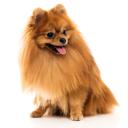
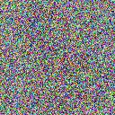
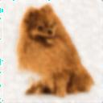

# Generative-Model-for-Visual-Signals
This repository contains an implementation of the Deep Image Prior (DIP) method for image restoration tasks. The notebook demonstrates the training and evaluation of a DIP model to denoise a given target image. Namely, "Guiding DIP Early Stopping with DDPM-inspired Supervision". 

<figure>
  <figcaption>Target Image</figcaption>
  
</figure>


<figure>
  <figcaption>Noisy Image</figcaption>
  
</figure>


<figure>
  <figcaption>Final Restored Image</figcaption>
  
</figure>

Please note that this is only a guided notebook and was not set to its full potential due to computational constraints. 

## Requirements

To run the code in the notebook, you will need the following packages:

- `torch`
- `torchvision`
- `scikit-image`
- `Pillow`
- `matplotlib`
- `numpy`

You can install the required packages using the following commands:

```bash
pip install torch torchvision scikit-image Pillow matplotlib numpy
```

## Notebook Overview

### Loading and Preparing the Target Image

The notebook starts by loading and preparing the target image. The target image is downsized to 128x128 pixels for simpler computational complexity and converted to a tensor.

### Model Architecture

Two models are defined in the notebook:

1. **DIPModel**: A simple Convolutional Neural Network (CNN) with four convolutional layers and ReLU activations.
2. **DeepDIPModel**: A deeper CNN with six convolutional layers and ReLU activations.

### Training the DIP Model

The training loop involves the following steps:

1. Generating a noisy version of the target image using a noise schedule.
2. Forward passing the noisy image through the DIP model.
3. Calculating the loss between the model's output and the target image.
4. Backpropagating the loss and updating the model's weights.
5. Logging the loss, PSNR, and SSIM at regular intervals.
6. Saving intermediate outputs for qualitative evaluation.

### Evaluation

The performance of the model is evaluated using two metrics:
- **Peak Signal-to-Noise Ratio (PSNR)**
- **Structural Similarity Index Measure (SSIM)**

The final denoised image is saved and displayed.

## Usage

To use this notebook, follow these steps:

1. Clone the repository and navigate to the project directory.
2. Install the required packages.
3. Open the notebook in Jupyter Notebook or JupyterLab.
4. Execute the cells sequentially to train the DIP model and evaluate its performance.
5. Feel free to replace "cute-spitz-dog.jpg" with any image of your liking.

## Results

The final output image generated by the DIP model will be saved as `final_dip_generated_image.jpg`. Intermediate results will be saved in the `./intermediate_output/` directory.

## References

- [Deep Image Prior](https://dmitryulyanov.github.io/deep_image_prior)
- Ulyanov, D., Vedaldi, A., & Lempitsky, V. (2018). Deep Image Prior. In CVPR.

## License

This project is licensed under the MIT License.
